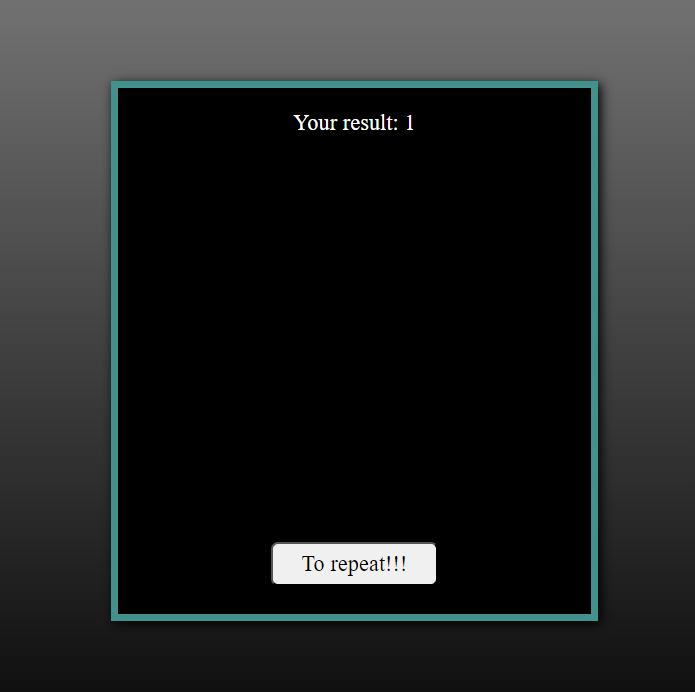

# Quiz app
>Component to accept a list of questions.
If you choose the right answer, it will turn green, if you choose the wrong one, it will turn red. At the end, it will be shown how many of the existing answers were correct.

### Tech stack
* [X] **React**: A JavaScript library for building user interfaces, particularly for single-page applications. It allows developers to create reusable UI components and manage the state of the application efficiently.
* [X] **CSS**: A style sheet language used for describing the presentation of a document written in HTML. It defines how elements should be displayed on the screen, including layout, colors, fonts, and more.
___

[Link to the site with the *Quiz App*](https://rss-777.github.io/QuizApp/)

___
### Screenshot

    
    
    

